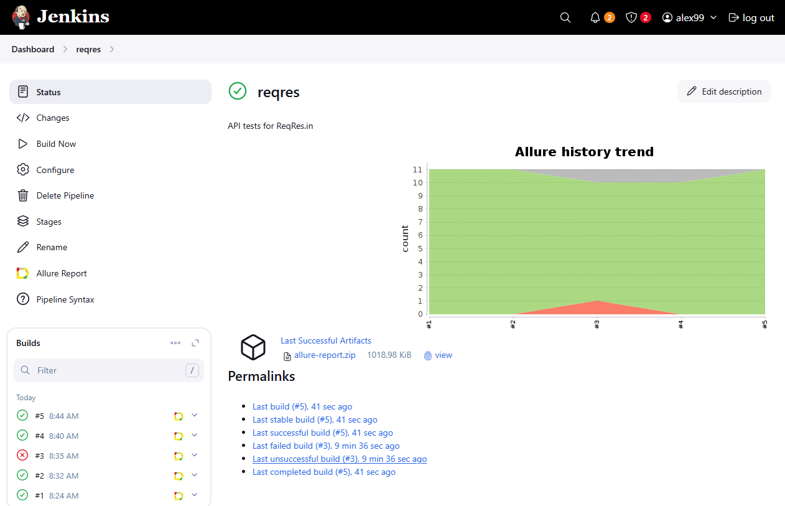

# Проект по автоматизации тестирования API для [ReqRes](https://reqres.in)

> ReqRes — это бесплатный сайт, предоставляющий демонстрационное API для тестирования HTTP-запросов.

## **Содержание:**
____

* <a href="#tools">Технологии и инструменты</a>

* <a href="#cases">Примеры автоматизированных тест-кейсов</a>

* <a href="#jenkins">Сборка в Jenkins</a>

* <a href="#console">Запуск из терминала</a>

* <a href="#allure">Allure отчет</a>

____
<a id="tools"></a>
## Технологии и инструменты

<p align="center">  
<a href="https://www.java.com/"></a>  
<a href="https://junit.org/junit5/"></a>  
<a href="https://rest-assured.io/"></a>  
<a href="https://maven.apache.org/"></a>  
<a href="https://github.com/allure-framework/allure2"></a>    
<a href="https://www.jenkins.io/"></a>  
</p>

* API автотесты написаны на **Java**.
* Сборщик **Maven**.
* Тестовые фреймворки **JUnit 5** и **REST-assured**.
* Для удаленного запуска реализована задача в **Jenkins** с генерацией отчета **Allure**.

____
<a id="cases"></a>
## Примеры автоматизированных тест-кейсов:
____
- ✓ *Создание пользователя*
- ✓ *Обновление данных пользователя*
- ✓ *Получение данных пользователя*
- ✓ *Получение списка пользователей*
- ✓ *Удаление пользователя*
- ✓ *Вход пользователем*
____
<a id="jenkins"></a>
## Сборка Jenkins:
<p align="center">  
<a href=""></a>  
</p>
<a id="console"></a>

____
<a id="console"></a>
## Команды для запуска
___
***Локальный запуск:***

```bash  
mvn clean test
```
___
<a id="allure"></a>
## Allure

### *Основная страница отчёта*

<p align="center">  
  
</p>  

### *Тест-кейсы*

<p align="center">  
  
</p>

### *Графики*

  <p align="center">  


</p>
